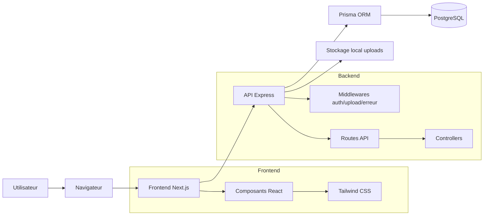
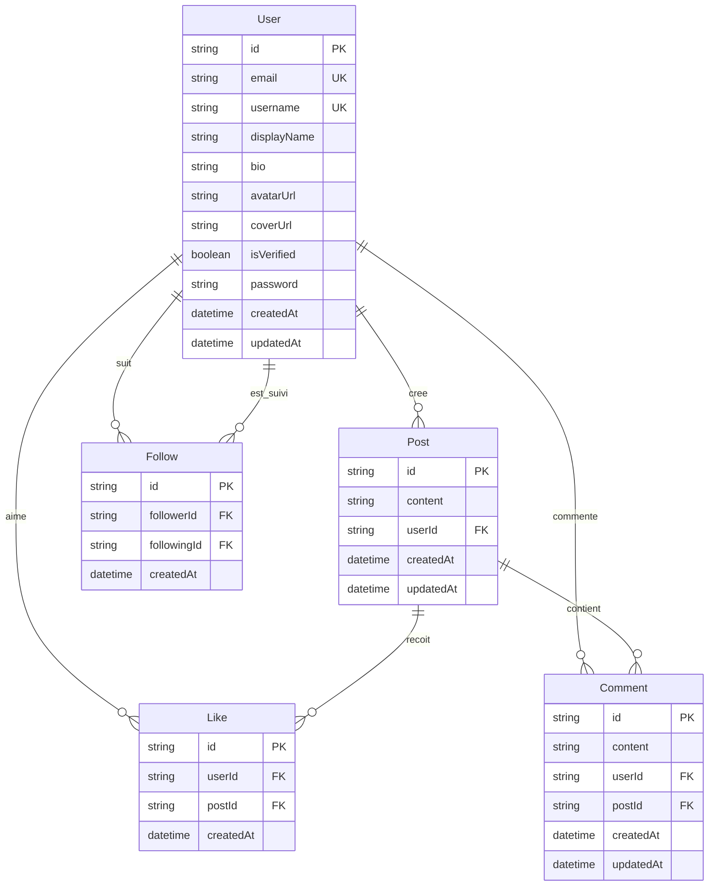
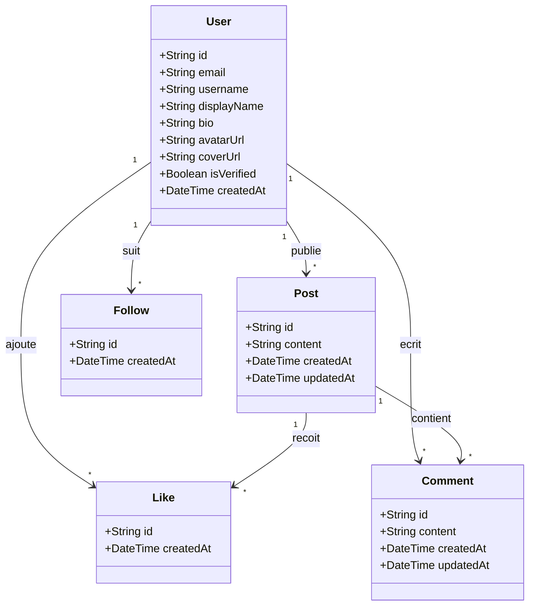
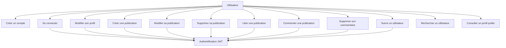
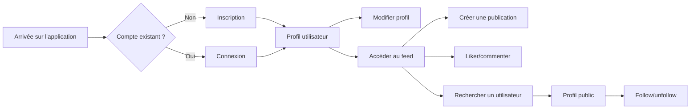
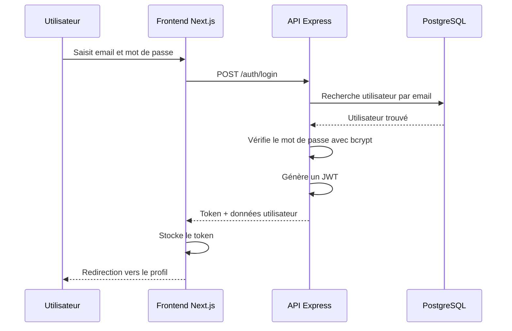
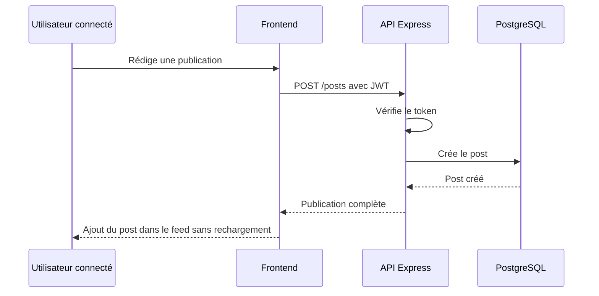
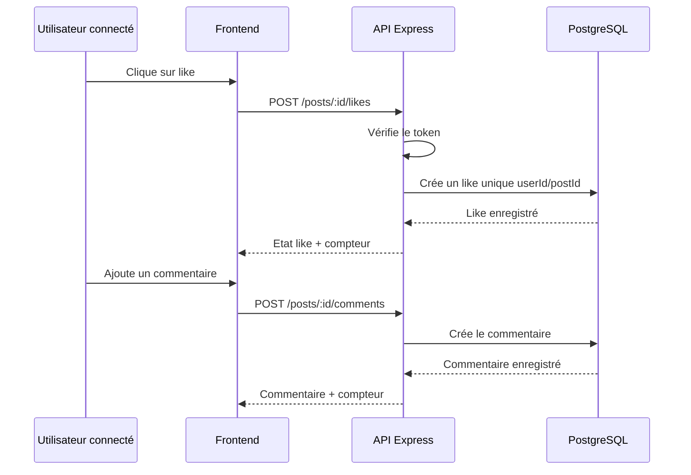
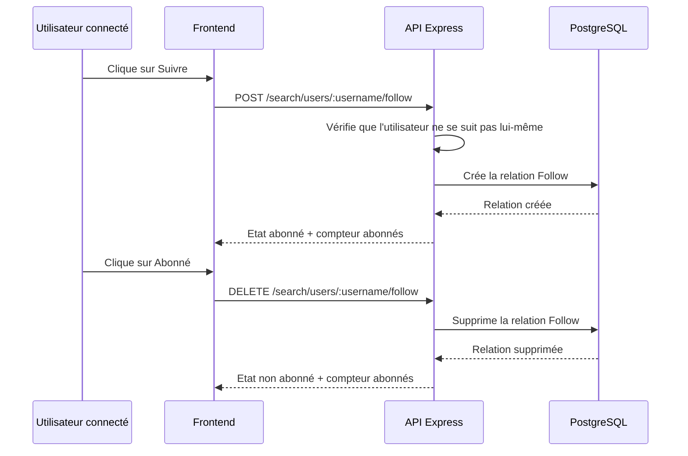

# Diagrammes de conception

## Architecture générale

## Modèle de données

## Classes principales côté métier

## Cas d'utilisation principaux

## Parcours utilisateur

## Séquence de connexion

## Séquence création de publication

## Séquence like/commentaire

## Séquence follow/unfollow

